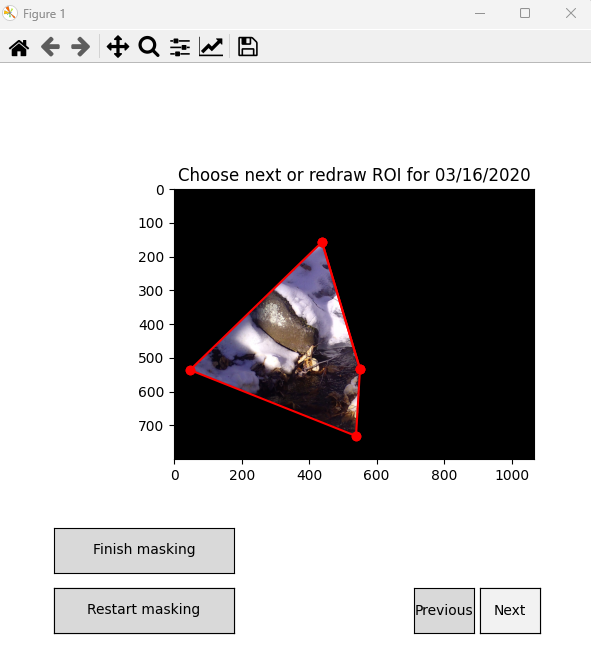

# Interactive ROI

This is an Interactive Region of Interest(ROI) Selection Application built using matplotlib that allows selection of region of interest in image files.
I originally wrote this code for use with river and water image files, but it can be extended for multiple purposes.

## Features
- Interactively select ROI on a series of image files by mouth clicks
  - Left click anywhere to start and make a polygon by dragging the mouse, finish drawing the polygon by double right click
- View your selection of ROI overlaid on an image
- View selected ROI Only
- Easily navigate series of images using the next and previous buttons
- Apply selected ROI to adjacent similar images
- Restart Masking for any images
- Click Finish Button
  - Saves ROI images to selected path ( if using water image files, results are saved in folders sorted by water years)
  - Saves a pandas dataframe that contains all ROI selection information of all images, which can be used to reconstruct images)

### Usage
Clone the repo, then run 
```Bash
python src/interactive_roi.py
```
### Example



## Credits
Based on [MATLAB's Region of Interest](https://www.mathworks.com/help/images/ref/roipoly.html) and [roipoly.py](https://github.com/jdoepfert/roipoly.py)
